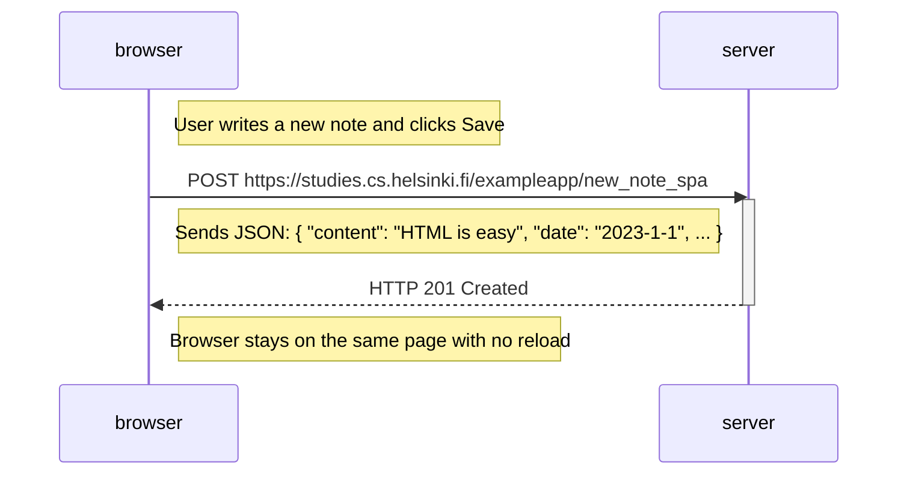

```mermaid
sequenceDiagram
    participant browser
    participant server

    Note right of browser: User writes a new note and clicks Save


    browser->>server: POST https://studies.cs.helsinki.fi/exampleapp/new_note_spa
    activate server
    Note right of browser: Sends JSON: { "content": "HTML is easy", "date": "2023-1-1", ... }
    server-->>browser: HTTP 201 Created
    deactivate server

    Note right of browser: Browser stays on the same page with no reload
```